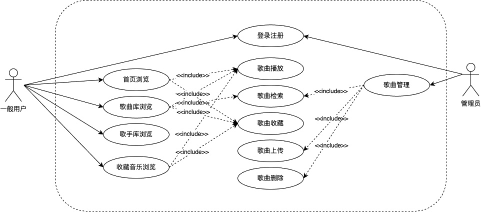
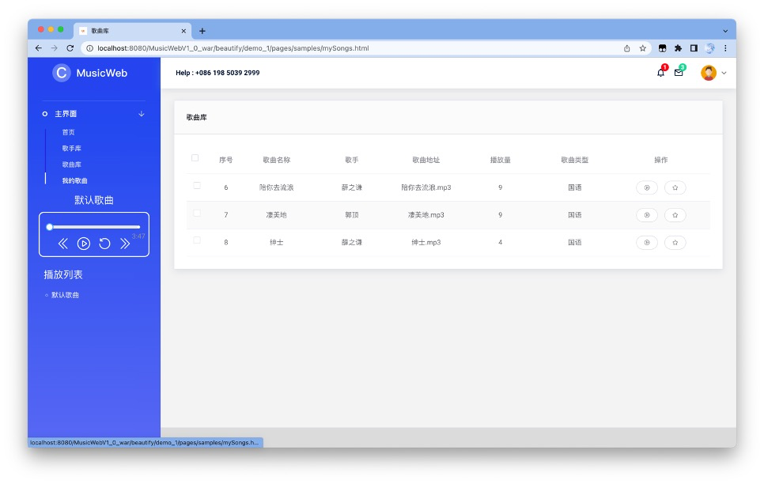
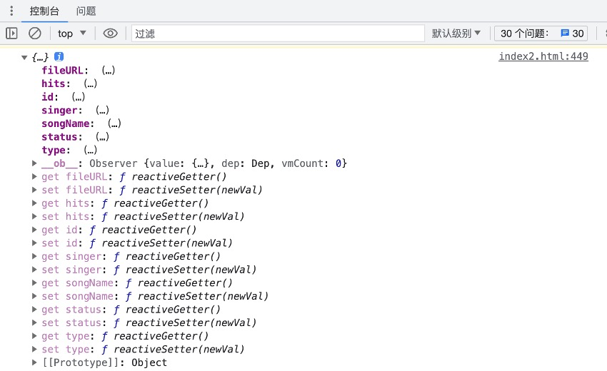

# MusicWebV2.0

设计题目: 甜橙音乐网

# 1  绪论

随着互联网技术的迅速发展，音乐产业也迎来了巨大的变革。传统的音乐销售模式逐渐被数字音乐取代，越来越多的人开始通过互联网来获取和分享音乐。在这个背景下，我决定创建一个全新的音乐网站项目。

我的目标是建立一个综合性的音乐平台，为用户提供丰富多样的音乐内容和服务。这个音乐网站将不仅仅是一个简单的在线音乐播放平台，而是一个集合了音乐推荐、音乐查询等功能的综合性音乐社区。

在这个音乐网站上，用户可以通过搜索功能轻松找到自己喜爱的歌曲和艺人。同时，我还将通过热度推荐算法，根据歌曲热度为用户推荐相关的音乐作品，提供个性化的音乐体验。除了音乐播放功能，我的音乐网站还将提供社交互动的功能。用户可以创建个人音乐库，收藏自己喜欢的歌曲和专辑，并与其他用户分享自己的音乐推荐。

为了提供更好的用户体验，我的音乐网站将采用直观友好的用户界面设计，确保用户能够轻松上手并享受音乐的乐趣。我还将不断更新和扩充音乐库，引入新的音乐流派和艺人，满足不同用户的需求。

总之，我的音乐网站项目旨在打造一个全面且富有互动性的音乐社区，为用户提供丰富多样的音乐内容和服务，让他们能够轻松地发现、分享和欣赏优质音乐。我希望通过这个音乐网站项目，为音乐爱好者们带来更加美妙的音乐体验。

# 2  需求分析

 

为了确保音乐网站项目的成功实施，我进行了全面的需求分析。以下是对该项目的需求描述、系统功能模块图、主要功能描述和用例图。

 

需求描述：

1. 用户注册和登录：用户可以通过注册账号并登录来使用音乐网站的所有功能。

2. 音乐搜索和播放：用户可以通过关键词搜索找到自己喜欢的歌曲和艺人，并在线播放音乐。

3. 音乐推荐：系统会根据用户的兴趣和偏好，通过热度推荐算法向用户推荐相关的音乐作品。

4. 个人音乐库：用户可以创建个人音乐库，收藏自己喜欢的歌曲和专辑，方便随时回顾和播放。

5. 后台管理平台：平台管理员可以在后台管理系统中对歌曲进行添加、删除、批量删除、分页查询，实现对平台的全面管理。

 系统功能模块图：


主要功能描述：

1.  首页：音乐网站的主页是用户进入网站的起点，提供热门推荐，让用户快速浏览和发现优质音乐。

2.  歌曲排行榜：音乐网站将根据歌曲播放量提供歌曲排行榜，让用户了解当前热门歌曲和流行趋势。

3.  歌手排行榜：用户可以查看歌手排行榜，了解当前最受欢迎的歌手和他们的代表作品。

4.  曲风分类：音乐网站将根据曲风将歌曲进行分类，方便用户根据自己的喜好进行浏览和发现。

5.  我的音乐：用户可以在个人中心管理自己的音乐，包括收藏喜爱的歌曲和专辑等。

6.  歌曲库检索：用户可以通过歌手、关键词搜索歌曲，快速找到自己想要听的音乐作品。

7.  歌手库展示：音乐网站将建立完整的歌手库，用户可以浏览不同歌手的资料、音乐作品和相关信息。

8.  音乐播放：用户可以在线播放音乐，包括快进、快退、列表播放等功能，提供流畅的音乐播放体验。

9.  登录注册管理：用户可以注册账号并登录音乐网站，管理个人信息和享受更多个性化的功能和服务。

10. 歌曲管理：管理员可以通过网站管理平台对歌曲库进行维护，包括更新歌曲库、更改歌曲状态、新增歌曲、批量删除歌曲等。

用例图：

该用例图展示了用户与音乐网站之间的主要交互场景。用户可以进行注册和登录，搜索和播放音乐，管理个人音乐库，进行社交互动，查看艺人动态和演出信息，以及提供反馈和建议。

 

总结：通过对音乐网站项目的需求分析，我明确了用户的核心需求，并设计了相应的系统功能模块和用例图。这将为项目的开发和实施提供指导，确保项目能够满足用户的期望，并提供优质的音乐体验。


# 3 数据库设计

## 3.1  数据流图：


 

 

 

 

## 3.2  数据字典：


 

 

## 3.3  数据库概念模型设计：

 


## 3.4  数据库逻辑结构设计：


## 3.5  数据库物理设计：

主要以歌曲对象为例，展示相关SQL语句：

```sql
-- 添加歌曲
insert into tb_song (songName, singer, fileURL, type, status)
values (#{songName}, #{singer}, #{fileURL}, #{type}, #{status});

-- 更新歌曲状态
update tb_song set status = #{status} where id = #{id};

-- 更新歌曲点击量
update tb_song set hits = hits + 1 where id = #{id};

-- 根据歌曲ID查询歌曲信息
select * from tb_song where id = #{song_id};

-- 根据条件动态查询歌曲
select * from tb_song
<where>
    <if test="songName != null"> and songName like #{songName} </if>
    <if test="singer != null and singer != ''"> and singer like #{singer} </if>
    <if test="status != null and status != ''"> and status like #{status} </if>
</where>;

-- 根据点击量查询前10条歌曲
select * from tb_song
<where>
    <if test="hits != null and hits != ''"> and hits like #{hits} </if>
</where>
order by hits DESC
limit 10;

-- 根据条件分页查询歌曲
select a.id, a.songName, b.singerName as singer, a.fileURL, a.hits, a.type, a.status
from tb_song a, tb_singer b
<where>
    a.singer = b.id
    <if test="songName != null and songName != ''"> and a.songName like #{songName} </if>
    <if test="singer != null and singer != ''"> and a.singer like #{singer} </if>
    <if test="status != null and status != ''"> and a.status like #{status} </if>
</where>
order by a.id
limit #{start}, #{rows};

-- 根据条件查询符合条件的记录总数
select count(*)
from tb_song a, tb_singer b
<where>
    a.singer = b.id
    <if test="songName != null and songName != ''"> and a.songName like #{songName} </if>
    <if test="singer != null and singer != ''"> and a.singer like #{singer} </if>
    <if test="status != null and status != ''"> and a.status like #{status} </if>
</where>;

-- 查询点击量前五的歌曲
select a.id, a.songName, b.singerName as singer, a.fileURL, a.hits
from tb_song a, tb_singer b
where a.singer = b.id and a.status = '1'
order by hits DESC
limit 5;

-- 查询所有歌曲的类型
select distinct type from tb_song;

-- 根据用户收藏查询歌曲
select distinct a.id, a.songName, b.singerName as singer, a.fileURL, a.hits, a.type, a.status
from tb_song a, tb_singer b, tb_userSong c
where a.singer = b.id and a.id = c.songID and c.userID = #{userID};

-- 根据歌曲ID删除歌曲
delete from tb_song where id = #{song_id};

-- 根据多个歌曲ID批量删除歌曲
delete from tb_song where id in
<foreach collection="ids" item="id" open="(" separator="," close=")">
    #{id}
</foreach>;

```

# 4  系统设计


# 5  编码实现

开发及运行环境：

开发软件：IntelliJ IDEA, DataGrip, WebStorm

操作系统：Macintosh，Intel Mac OS X 10_15_7

浏览器：Google Chrome 114.0.0.0，基于 Chromium 114 版本


展示图 1登陆页


展示图 2注册页


展示图 3用户首页


展示图 4用户首页


展示图 5 播放器细节展示


展示图 6歌手库


展示图 7歌曲库



展示图 8收藏歌曲页

 

展示图 9歌曲后台管理页


# 6  程序调试情况  


在整个项目中，我引入了一个logback.xml文件，用于配置日志记录器的行为。使得程序可以将不同级别的日志消息输出到控制台。具体的文件代码如下：


在MyBatisTest文件中，为每一个函数设计对应的测试参数，测试每一个Mapper下，SQL语句的正确性，能否正确实现DAO层增删改查的功能。

以条件分页查询函数为例，测试代码如下：

测试过程中编写的代码总览：


此外，对于服务层和Servlet层的相关函数，我会在程序运行之后直接访问Servlet层方法对应的网络地址，如：http://localhost:8080/MusicWebV1_0_war/song/selectAll,来检查对应方法向网络端发送的JSON数据，同时，对于报错情况，可以通过浏览器上显示的错误日志找到出错的文件和代码位置。


与此同时，我也设计了例如console.log(this.multipleSelection)这类函数，来检查前端网页上对于用户操作所响应的可行性以及响应信息的具体内容。



# 7  系统总结

## 7.1  本系统具有以下特点：

1. 综合性：本系统是一个综合性的音乐网站，提供了丰富多样的功能和服务，包括歌曲搜索和播放、个人音乐库管理、歌手信息展示等。用户可以在一个平台上满足多样化的音乐需求。

2. 用户体验：系统能为其推荐热度高的音乐作品和歌手信息，提供个性化的音乐体验。用户可以创建个人音乐库，收藏喜欢的歌曲，定制自己的音乐播放列表。同时，前端界面上渐变式的动态效果，能为用户提供良好舒适的观感和使用体验。

3. 歌曲管理：完善的歌曲信息管理：本系统提供了对歌曲的全面管理，包括歌曲名称、歌手、文件URL、曲风分类、状态等信息的录入、修改和删除。这使得系统能够准确记录和管理大量的歌曲信息，并提供给用户进行搜索和浏览。同时，系统具备统计歌曲点击量的功能，能够记录每首歌曲被点击的次数。此外，系统提供了批量删除歌曲的功能，方便管理员对多个歌曲进行统一操作，提高操作效率和便捷性。

 

## 7.2  存在的问题：

1. 歌曲库和歌手信息完善：系统的歌曲库和歌手信息需要不断更新和完善，添加更多流派和新的艺人，以满足用户对不同类型音乐的需求。

2. 缺少用户管理：系统目前在用户管理方面存在不足，缺乏完善的用户管理功能。后台无法通过系统查看当前系统中的所有用户和他们的信息。

3. 歌曲评论生态不健全：系统缺乏健全的歌曲评论生态，缺少用户对歌曲的评论和互动交流功能，限制了用户之间的互动性。

 

## 7.3  改进意见：

1.歌曲库和歌手信息完善：系统可以建立用户反馈机制，了解用户需求，并根据需求定期更新推荐热门艺人和最新歌曲，以满足用户对多样化音乐的需要。

2.用户管理功能改进：系统应完善用户管理功能，包括用户注册、登录、个人资料管理和权限管理等。后台管理界面应提供对用户信息的查看和管理功能，以便管理员能够更好地了解和管理系统中的用户。

3.加强歌曲评论和互动功能：系统应提供用户对歌曲的评论和互动交流功能，包括用户发表评论、回复他人评论、点赞和分享等。同时，可以引入社交媒体，让用户可以将自己对音乐的评论和推荐分享到其他社交平台上，促进更广泛的音乐交流和互动。

 

# 8  课程设计总结

在完成本课程设计的过程中，我收获了许多宝贵的经验和知识，也收获了不少感悟：

1. 综合运用所学知识：本课程设计要求我将所学的技术知识，如MySQL、JDBC、JavaWeb等，应用到实际项目中。通过实际操作和实践，我更深入地理解了课堂上学到的数据库设计、系统分析、编程等知识，并且在实践中自主探索，学习了HTML、CSS、Vue、Ajax、Tomcat等新的技术知识。

2.项目规划与管理：在本课程设计中，我需要进行项目的规划和管理，包括需求分析、系统设计、编码实现和测试等。通过这次项目实践， 我更好地理解了软件工程设计过程中的各个环节，也认识到了前期规划、系统设计对整个软件开发的重要意义，并将书本上所学的设计方法运用到了项目中。

3. 解决问题的能力：在项目开发过程中，我遇到了各种问题和挑战，如技术难题、需求变更等。通过主动学习，我能够排除各种bug，并找到解决问题的方法和策略。这锻炼了我问题解决的能力和自主学习的能力，在面对困难的时候能够迎难而上、坚持到底。

# 9  参考文献

无
